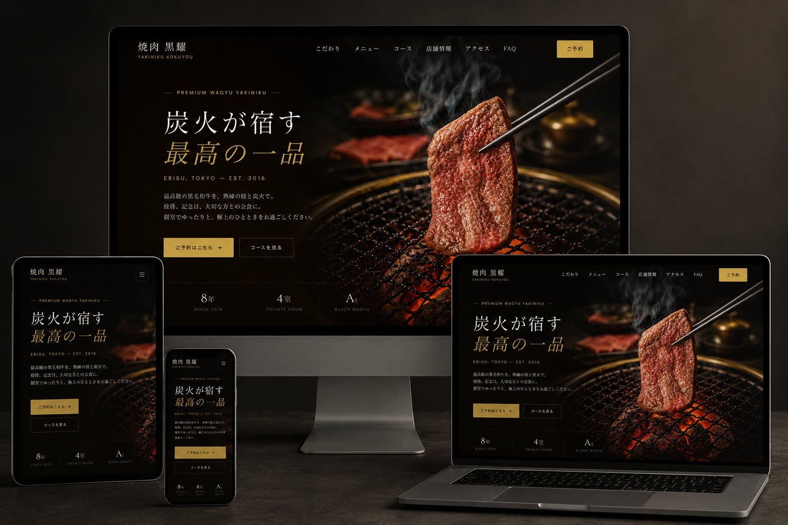

<div align="center">

# 焼肉 黒耀 — Web Site Renewal Plan

**ビジネス課題への解答としてのデザイン。**

恵比寿の高級焼肉店「焼肉 黒耀」ブランドサイトの新規制作プロジェクト企画提案書。
企画 → 情報設計 → デザイン → 実装まで一気通貫で担当した、全30ページの提案ドキュメントです。

<br />



<br />

[**📄 View Proposal**](https://hirotonozaki.github.io/yakiniku-kokuyou-proposal/) ・ [**🌐 Live Site**](https://hirotonozaki.github.io/yakiniku-kokuyou/) ・ [**📁 Repository**](https://github.com/hirotonozaki/yakiniku-kokuyou-proposal)

<br />


</div>

<br />

## 📖 Overview ／ 概要

「焼肉 黒耀」ブランドサイト制作にあたっての、戦略・情報設計・デザイン意図・実装方針・SEO・振り返りまでを1冊にまとめた制作企画提案書です。「ただ綺麗なサイトを作る」のではなく、**ビジネス課題に答えるデザイン**として何ができるかを起点に、設計プロセスを30ページで記録しました。

| Item | Detail |
| :--- | :--- |
| **Project Type** | 制作企画提案書（ポートフォリオ） |
| **Sections** | 全30ページ／30セクション |
| **Format** | HTML / CSS（A4 横・PDF 出力対応） |
| **Role** | 企画 / 情報設計 / デザイン / 実装 |
| **Stack** | HTML5 / CSS3（フレームワーク不使用） |
| **Hosting** | GitHub Pages |

<br />

## 🌐 Live Site ／ サイトURL

https://hirotonozaki.github.io/yakiniku-kokuyou-proposal/

> 表紙右下の **「VIEW LIVE SITE」** ボタンから実装サイトへ遷移できます。
> 企画書最終ページ（P.30）のQRコードからも実機での閲覧が可能です。

<br />

## 💻 GitHub ／ リポジトリ

https://github.com/hirotonozaki/yakiniku-kokuyou-proposal

<br />

## 🛠 Tech Stack ／ 使用技術

| 領域 | 技術 |
| :--- | :--- |
| **Markup** | HTML5（セマンティック構造、アクセシビリティ配慮） |
| **Styling** | CSS3 / CSS Variables（デザイントークン一元管理、`@media print` 対応） |
| **Typography（欧文）** | Cormorant Garamond / DM Sans（Google Fonts、`preconnect` で初期描画最適化） |
| **Typography（和文）** | 游明朝（システム搭載フォントスタック） |
| **Print** | `@page` / `@media print`（A4 横・1280×900px 相当） |
| **Hosting** | GitHub Pages |

<br />

## 💡 Concept ／ 制作意図

> 「実店舗の格を、画面の中でも保つ」 — これを唯一の設計指針として、企画書自体も同じ思想で組みました。

恵比寿の高級焼肉店は **接待・記念日・デート** 利用が中心で、ユーザーは常に「失敗できない夜」という文脈で店を選びます。Webサイトは、料金や雰囲気が言葉で伝わるだけでは足りず、画面そのものが店の照明設計と同じ温度を持つ必要がある。これが企画の出発点です。

30ページ全てを **「美術館の図録」** の文体で統一し、ビジネス課題への解答としてのデザインを最後まで一貫させています。

| 領域 | 方針 |
| :--- | :--- |
| **Color** | 漆黒 `#0A0805` × 古金色 `#C9A84C` のミニマル構成 |
| **Typography** | Cormorant Garamond × 游明朝 の和洋ペアリング |
| **Layout** | 編集デザイン的な広い余白、グリッドの厳密な統一 |

<br />

## ✨ Highlights ／ 工夫した点

### 1. 戦略・企画（P.03–09）
プロジェクト概要、KPI設計、ペルソナ設計、競合分析、課題の根本原因とビジネスインパクトの定量化までを「数字で語る」構成にしました。

### 2. デザイン設計（P.10–12）
サイトコンセプト、ビジュアルランゲージシステム、「**なぜそうしたか**」の意図開示。感覚ではなく理由として明記しています。

### 3. 情報設計・導線（P.13–22）
サイトマップ、ワイヤーフレーム、UI/UX設計、レスポンシブの再設計思想、予約導線とCTA階層、空席予約UI、Googleマップ導線、制作で工夫した6つの細部。

### 4. 技術・振り返り（P.23–30）
SEO 7レイヤー戦略、使用技術、スケジュール、実務ポイント、今後の改善案、トップページ表示イメージ、公開リソース（QRコード）。

### 5. PDF 出力対応
`@media print` と `@page` の指定により、ブラウザの印刷機能から **A4 横・全30ページ** の PDF として出力可能。Web 閲覧と紙資料、どちらにも対応します。

<br />

## 📂 Directory ／ ディレクトリ構成

```
yakiniku-kokuyou-proposal/
├── index.html              # 企画提案書本体（全30ページ／30セクション）
├── README.md
├── css/
│   └── proposal.css        # 全スタイル（変数 → ベース → コンポーネント → @media print）
└── assets/
    └── images/
        ├── preview-mockup.png  # トップページ表示イメージ（PC/SP併記モックアップ）
        └── qr.png              # 実装版サイトへの遷移用QRコード
```

<br />

## 🖼 Screenshot ／ スクリーンショット


<br />

## 📱 Responsive ／ レスポンシブ対応

| Device | 推奨度 | 備考 |
| :--- | :---: | :--- |
| 💻 PC（1280px+） | ◎ | 制作時の意図通りに表示されます |
| 📱 タブレット（横向き） | ◯ | iPad 横向きなど 1024px+ で快適に閲覧可能 |
| 📱 スマートフォン | △ | A4 横レイアウトのためピンチイン推奨。PDF出力後の閲覧も可 |

紙資料を PDF として読む感覚に近い体験を意図しているため、レスポンシブ縮小ではなく **元のレイアウトをそのまま保持** する設計を選択しました。

<br />

## 📄 PDF Output ／ PDF出力方法

ブラウザの印刷機能から以下を選択してください。

| 項目 | 値 |
| :--- | :--- |
| 保存先 | PDFに保存 |
| 用紙サイズ | A4 横 |
| 余白 | なし |
| 背景画像 | オン |

<br />

## 👤 Author ／ 制作者情報

<div align="center">

### **Hiroto Nozaki**

Web Production / Front-end

[](https://github.com/hirotonozaki)
[](https://hirotonozaki.github.io/hiroto-nozaki-portfolio/)

</div>

<br />

<div align="center">

> 本企画書はポートフォリオ用に制作した架空店舗のデモであり、実在する店舗・事業とは関係ありません。

<sub>© 2026 Hiroto Nozaki</sub>

</div>
