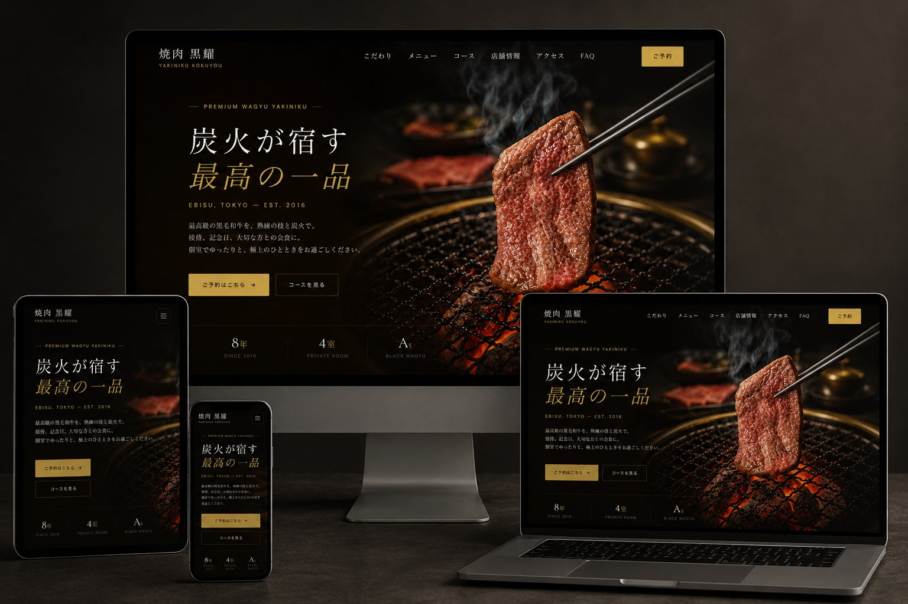

[README.md](https://github.com/user-attachments/files/28168412/README.md)
<div align="center">

# 焼肉 黒耀 — Brand Experience Site

**実店舗の格を、画面の中でも保つ。**

恵比寿の高級焼肉店「焼肉 黒耀」のブランドサイト。
企画設計から実装まで一気通貫で担当した、実店舗を想定したブランディング制作物です。

<br />



<br />

[**🌐 Live Site**](https://hirotonozaki.github.io/yakiniku-kokuyou/) ・ [**📄 Proposal (Coming Soon)**](https://hirotonozaki.github.io/yakiniku-kokuyou-proposal/) ・ [**📁 Repository**](https://github.com/hirotonozaki/yakiniku-kokuyou)

<br />


</div>

<br />

## 📖 Overview ／ 概要

恵比寿の高級焼肉店を想定し、**接待・記念日・デート利用**にふさわしい品格を画面で再現することを目指したブランドサイトです。料金や雰囲気が言葉で伝わるだけでは足りず、画面そのものが店の照明設計と同じ温度を持つ必要がある — これを設計の起点としました。

| Item | Detail |
| :--- | :--- |
| **Project Type** | ブランディングサイト（架空クライアント） |
| **Pages** | 2ページ（Top / Reserve） |
| **Role** | 企画 / 情報設計 / デザイン / 実装 |
| **Period** | 約3週間 |
| **Stack** | HTML5 / CSS3 / Vanilla JavaScript |
| **Hosting** | GitHub Pages |

<br />

## 🌐 Live Site ／ サイトURL

https://hirotonozaki.github.io/yakiniku-kokuyou/

<br />

## 💻 GitHub ／ リポジトリ

https://github.com/hirotonozaki/yakiniku-kokuyou

<br />

## 🛠 Tech Stack ／ 使用技術

| 領域 | 技術 |
| :--- | :--- |
| **Markup** | HTML5（セマンティック構造、`aria-*` によるアクセシビリティ配慮） |
| **Styling** | CSS3 / CSS Variables（Flexbox / Grid、`prefers-reduced-motion` 対応） |
| **Interaction** | Vanilla JavaScript（ES6+、IIFE、IntersectionObserver） |
| **Typography** | Cormorant Garamond / DM Sans（Google Fonts）／ 游明朝（システムフォント） |
| **Images** | WebP / JPEG 併設 ／ CSS `image-set()` で `background-image` のフォーマット切り替え ／ 1200px リサイズ |
| **Hosting** | GitHub Pages |

<br />

## 💡 Concept ／ 制作意図

> 「実店舗の格を、画面の中でも保つ」

恵比寿の高級焼肉店は **接待・記念日・デート** 利用が中心で、ユーザーは常に「失敗できない夜」という文脈で店を選びます。だからこそWebサイトは、料金や雰囲気が言葉で伝わるだけでは足りず、画面そのものが店の照明設計と同じ温度を持つ必要がある。これがこのサイトの出発点です。

| 領域 | 方針 |
| :--- | :--- |
| **Color** | 漆黒 `#0A0805` × 古金色 `#C9A84C` のミニマル構成 |
| **Typography** | Cormorant Garamond × 游明朝 の和洋ペアリング |
| **Layout** | 編集デザイン的な広い余白、写真を主役にしたグリッド |
| **Motion** | IntersectionObserver による軽量なフェードのみ |

<br />

## ✨ Highlights ／ 工夫した点

### 1. 2階層 CTA 設計（ご予約 / コースを見る）
検討段階の異なるユーザーを取りこぼさないよう、行動指向の CTA と情報指向の CTA を並列配置しました。

### 2. 空席カレンダー予約UI
一般的なフォーム送信ではなく「席選びの体験」として再設計。日付 → 人数 → 確認のステップフォームで、心理的負担を最小化しています。

### 3. 営業時間ステータス自動表示
JavaScript で現在時刻から「営業中／準備中」を動的判定し、ヘッダーに常時表示。実店舗らしい「いま」を画面に持ち込みました。

### 4. タブ式メニュー切替（桐・竹・松）
3コースをスクロールせず比較可能に。ファーストビュー時は1件目を開いた状態で表示し、認知性を高めています。

### 5. FAQ アコーディオン
同時展開は1件のみに制限。一度に視界に入る情報量を絞り、可読性を担保しました。

### 6. アクセシビリティ
`aria-expanded` / `aria-controls`、`:focus-visible`、`prefers-reduced-motion` を省略せず実装しています。

### 7. 画像最適化（WebP 優先配信 / `image-set()` 採用）
全ての写真を WebP / JPEG 両形式で配信し、ブラウザが対応している方を自動選択させる構成にしました。1200px リサイズと併せて、画像合計サイズを **20.4 MB → 1.1 MB（約 95% 削減）** に圧縮しています。

**なぜ `<picture>` ではなく `image-set()` を使ったか**

本サイトはブランド世界観を優先し、写真をテキストの装飾として `background-image` で重ねる設計を採っています（`` タグは使用 0 件）。`<picture>` 要素は `` をラップする構文のため、背景画像には適用できません。そこで CSS Images Level 4 仕様の `image-set()` を採用し、`background-image` でも `<picture>` と同等のフォーマット切り替え（WebP 優先・JPEG フォールバック）を実現しました。古いブラウザにはプレーンな `url()` 宣言で3段階フォールバックしています。

```css
.element {
  background-image: url("hero.jpg");                              /* 古いブラウザ */
  background-image: -webkit-image-set(                            /* Safari 旧版 */
    url("hero.webp") type("image/webp") 1x,
    url("hero.jpg")  type("image/jpeg") 1x);
  background-image: image-set(                                    /* モダンブラウザ */
    url("hero.webp") type("image/webp") 1x,
    url("hero.jpg")  type("image/jpeg") 1x);
}
```

<br />

## 📂 Directory ／ ディレクトリ構成

```
yakiniku-kokuyou/
├── index.html              # トップページ（コンセプト〜FAQまで1ページ完結）
├── reserve.html            # 予約ページ（空席カレンダー・人数選択・ステップフォーム）
├── README.md
├── css/
│   ├── style.css           # 共通スタイル（変数 → ベース → コンポーネント）
│   └── reserve.css         # 予約ページ専用スタイル
├── js/
│   ├── main.js             # 全 UI ロジック
│   └── reserve.js          # 予約フロー専用ロジック
└── assets/
    └── images/             # ブランド写真（.jpg / .webp 併設）／ OGP / モックアップ
        ├── hero-main.{jpg,webp}
        ├── concept-{wagyu,charcoal,room}.{jpg,webp}
        ├── menu-{wagyu,harami,tongue}.{jpg,webp}
        ├── course-main.{jpg,webp}
        ├── access-store.{jpg,webp}
        ├── ogp.jpg                                 # SNS シェア用 OGP（1200×630）
        └── preview-mockup-v2.png                   # README プレビュー
```

<br />

## 🖼 Screenshot ／ スクリーンショット


<br />

## 📱 Responsive ／ レスポンシブ対応

モバイルファーストで設計し、以下のブレイクポイントで動作を確認しています。

| Device | Width | 主な変化 |
| :--- | :--- | :--- |
| 📱 Mobile | ~ 767px | ハンバーガー + ドロワー / 1カラム |
| 📱 Tablet | 768 ~ 1023px | 2カラム / ナビ表示切替 |
| 💻 Desktop | 1024px ~ | フル表示 / 3カラムグリッド |

PC とモバイルでアクセス情報の表示優先度を切り替え、デバイス特性に合わせた導線を組んでいます。

<br />

## 📄 Proposal ／ 企画書

> 🚧 **Coming Soon** — 現在制作中です（公開予定：近日）

本サイトの背景にある設計意図・ターゲット定義・KPI・競合分析・情報設計の各プロセスは、別途**企画提案書**としてまとめる予定です。実案件における提案フロー（ヒアリング → 課題定義 → コンセプト → 情報設計 → デザイン → 実装計画 → スケジュール・見積もり）を、A4 縦の PDF 形式で公開する予定です。

🔗 https://hirotonozaki.github.io/yakiniku-kokuyou-proposal/ （公開予定）

<br />

## 👤 Author ／ 制作者情報

<div align="center">

### **Hiroto Nozaki**

Web Production / Front-end

[](https://github.com/hirotonozaki)
[](https://hirotonozaki.github.io/hiroto-nozaki-portfolio/)

</div>

<br />

<div align="center">

> 本サイトはポートフォリオ用に制作した架空店舗のデモであり、実在する店舗・事業とは関係ありません。

<sub>© 2026 Hiroto Nozaki</sub>

</div>
